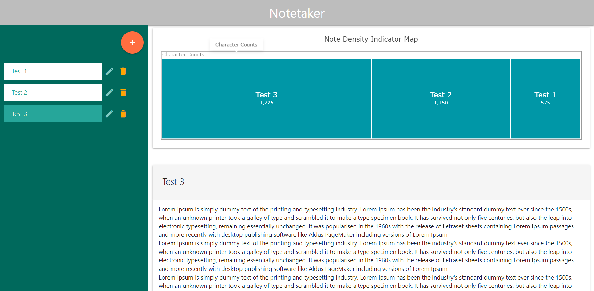
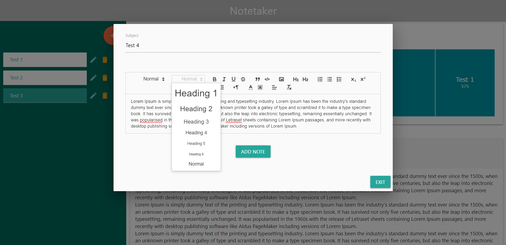
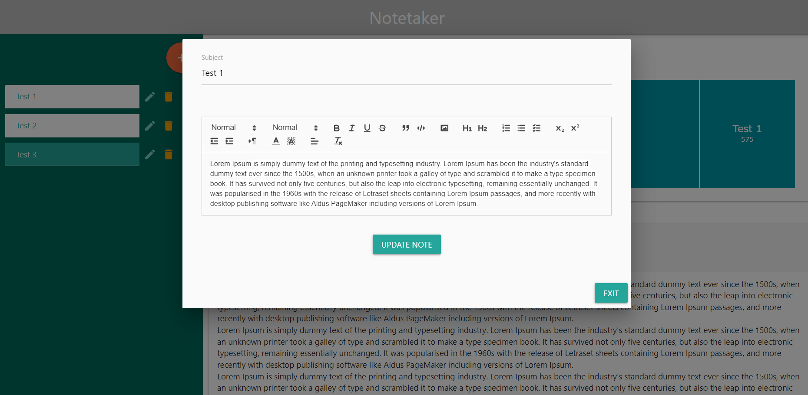

## About The Project
This project attempts to provide a solution for users who want the ability to take notes in a private 
and quick manner. Notes are stored in localStorage so there is no worry about privacy issues about user data
being handled inappropriately. Notes are also read and editted quickly because it is done locally and requires 
no connection to the internet.

### Built With 

* Materialize CSS Framework
* AG Charts
* Quill Text Editor
* JQuery

## Getting Started
This note taking web app was made so that the user doesn't have to download any libraries or unknown software.
All they need is a current web browser and visit our page to start taking notes!

### Prerequisites 
* A modern and up-to-date web browser
* Visit https://philipmcf.github.io/Project-1-Note-Taking-App/ and start utilizing our note taking web app right away!

### Installation 
N/A

## Usage 

The image above showcases our web app. There is an aside menu on the left with the list of submitted notes.
Clicking the orange plus button brings up a modal where you can enter in a new note.
When the pencil button is clicked, a different modal will pop up where you can edit that note.
When the trash bin button is clicked, it will delete the note it was beside.
Above the note on the right main display is a chart of the note density to visually see the size of all the users notes.

The image above shows a modal popup that appears after clicking the add button. 
The user is able to enter a subject for that note and then they can enter in content below that styled and formatted with 
the available options in the editor toolbar. When ready, the user clicks add note and it will be pushed to localStorage.
The page will refresh and we can now see that is has appeared on the left aside menu.

The image above shows a modal popup that appears after clicking the edit button. 
The modal loads the subject and content for that note and the user can edit it as they please.
When ready, the user clicks update note and it will be updated in localStorage.
The page will refresh and clicking it on the left aside menu will show the updated note.

## Roadmap
- [x] Create, read, update, and delete notes
- [x] Responsive when viewing on varying devices and screen sizes
- [x] Implement Quill for better formatting of notes
    - [ ] Ability to adjust/resize images
    - [ ] Add hyperlink to text
- [x] Implement AG Charts to visualize size/density of note entries.
- [ ] Sync notes across devices
- [ ] Native iOS/Android app

## Contributing
If you have a suggestion that would make this better, please fork the repo and create a pull request. You can also simply open an issue with the tag "enhancement". Don't forget to give the project a star! Thanks again!

## License 

Distributed under the MIT License. See `LICENSE.txt` for more information.

## Contact 
William Schultz - linkedinwill23@gmail.com - https://github.com/ws-data-engineering

Olyad Kitila - olyad987@gmail.com - https://github.com/thymetime

Philip McFarland - philipsm1998@gmail.com - https://github.com/PhilipMcF

Project Link - https://github.com/PhilipMcF/Project-1-Note-Taking-App

## Acknowledgments 
* [Quill Text Editor](https://quilljs.com/docs/api)
* [AG Charts](https://charts.ag-grid.com/gallery/simple-treemap/)
* [Materialize CSS Modals](https://materializecss.com/modals.html#!)
* [Materialize CSS Sidenav](https://materializecss.com/sidenav.html)
* [Materialize CSS Colors](https://materializecss.com/color.html)
* [Materialize CSS Cards](https://materializecss.com/cards.html)
* [Materialize CSS Buttons](https://materializecss.com/buttons.html)
* [MDN localStorage](https://developer.mozilla.org/en-US/docs/Web/API/Window/localStorage)